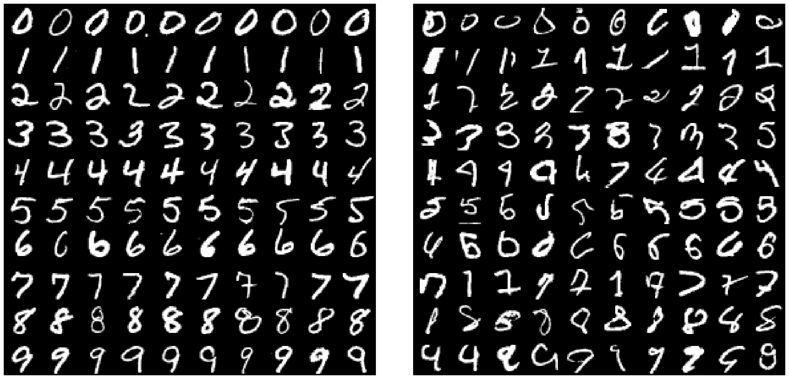

# Characterizing Structural Regularities of Labeled Data in Overparameterized Models

[Paper](https://arxiv.org/abs/2002.03206)	
&bull; [Project](https://pluskid.github.io/structural-regularity/)
&bull; [C-scores for CIFAR-10](https://pluskid.github.io/structural-regularity/cscores/cifar10-cscores-orig-order.npz)
&bull; [C-scores for CIFAR-100](https://pluskid.github.io/structural-regularity/cscores/cifar100-cscores-orig-order.npz)
&bull; [C-scores for ImageNet](https://pluskid.github.io/structural-regularity/cscores/imagenet-cscores-with-filename.npz)
&bull; [Checkpoints](https://github.com/google-research/heldout-influence-estimation)

We demonstrate the held out training algorithm and c-score estimation procedure 
with an example on MNIST. The c-score estimation on larger and more challenging datasets
(CIFAR / ImageNet) are essentially the same as this example shows, except that extra infrastructures
such as GPU clusters, job scheduling, checkpoint saving and resuming, are needed.
Because MNIST is small and can be easily fit with a small network and very few epochs, 
we are able to provide a demo to show the core algorithm with minimum dependency on 
irrelevant infrastructure code, which could run in reasonable time on a single GPU. 
We also provide pre-computed c-scores on CIFAR-10/CIFAR-100 and ImageNet for people
who are interested in playing with those datasets.

# Code Structure and Dependency

The demo contains a single python file `mnist.py`, which train multi-layer perceptrons on MNIST
to estimate the C-scores, and plot examples as ranked by the estimated C-scores.

The code has the following dependencies:

- Python 3
- [JAX](https://github.com/google/jax)
- [tensorflow-datasets](https://www.tensorflow.org/datasets)
- [tqdm](https://github.com/tqdm/tqdm)
- Numpy, Matplotlib

After running, the code will save the computed cscores in `cscores.npy` and
export a figure in `mnist-examples.pdf` like the one below. It shows some MNIST 
training examples from each of the 10 classes. 
The left block shows the examples with the highest C-scores,
and the right block shows the examples with the lowest C-scores.

On a single NVidia V100 GPU, with subset ratio being 0.1, 0.2, ..., 0.9
and 200 runs for each subset ratio, it takes less than 2 hours to run.

Note: `tensorflow-datasets` stores the MNIST examples in a different order
from the [official MNIST dataset binary](http://yann.lecun.com/exdb/mnist/).
